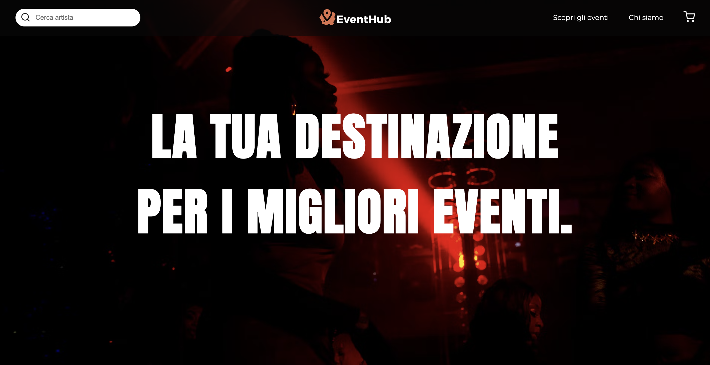
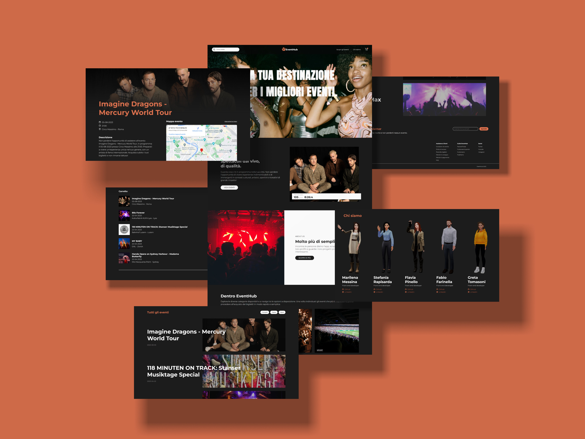
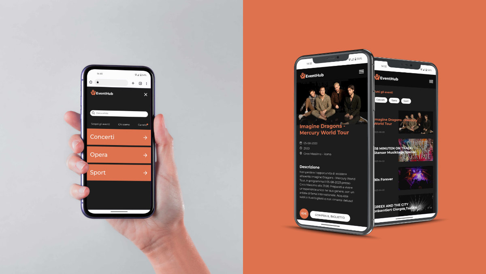
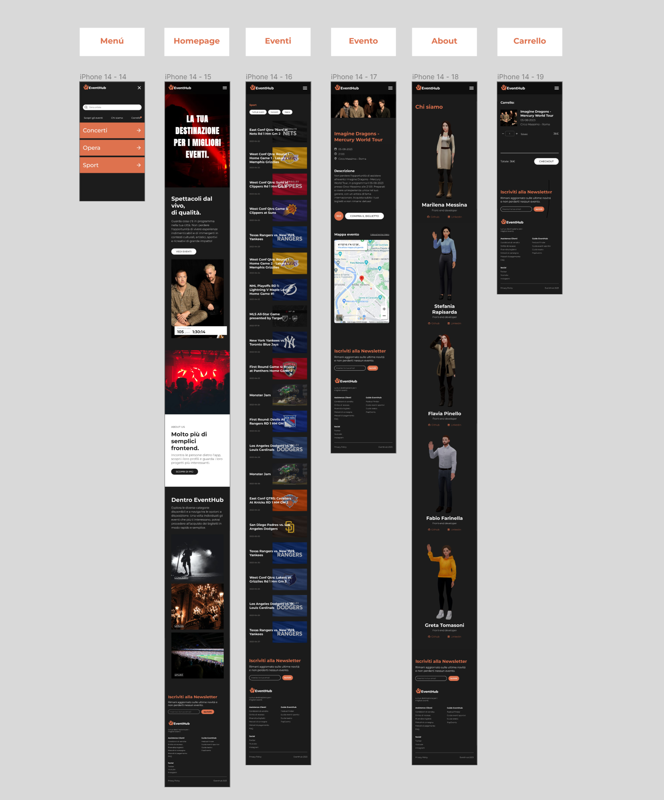
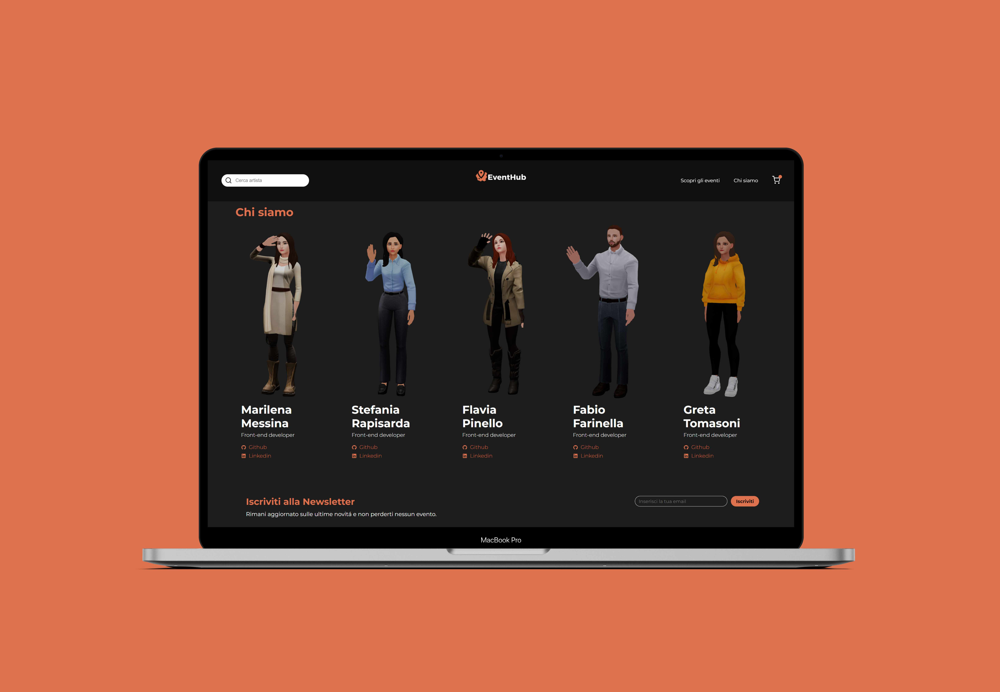

<div align="center">
  
</div>


<h2 style="text-align: center;">EventHub - your destination for the best events </h2>

<p>Welcome to our event ticket platform! This project was developed by a team of frontend developers. <br/> The goal of this platform is to allow users to browse and purchase tickets for upcoming events.</p>
<a href="https://project-cb6-terence-hill.vercel.app/">Demo</a>
<h4 {align="center"}> Created at Edgemony Coding Bootcamp #6 </h4>


<br>

<div align="center">
  
</div>


<h2>Technologies used:</h2>
<p>Our platform was developed using the following technologies:</p>
  <ul>
    <li>HTML</li>
    <li>SASS</li>
    <li>Javascript</li>
    <li>React.js</li>
    <li>Next.js</li>
  </ul>
<br>

<p>We also used a number of other libraries and tools, including:</p>
  <ul>
    <li>TicketMaster API</li>
    <li>Local Storage</li>
    <li>UseReducer & UseContext hooks</li>
    <li>GIT / GitHub</li>
    <li>Figma</li>
  </ul>

<br>

<h2>Mobile responsive</h2>

<p>The design and build of our website, involved creating layouts that are optimized for small screens first before designing for larger screens.
This approach ensured that website content is easily accessible and readable on mobile devices, such as smartphones and tablets, while still being adapted for desktop and laptop screens.
</p>

<div align="center">
<div>     </div>
</div>

<h2>Design</h2>
<p>We designed the website from scratch using the tool Figma. Besides, we also used the Css-postprocessor SASS and Css Modules.
</p>
<div align="center">
<div>     </div>
</div>

<h2>3D Implementation</h2>

<p>We built the About page using the following technologies: <br>
- Three.js <br>
- React/Fiber <br>
- React Drei 
</p>
<div align="center">
<div>     </div>
</div>

## How to run it:

First, run the development server:

```bash
npm run dev
# or
yarn dev
```

Open [http://localhost:3000](http://localhost:3000) with your browser to see the result.

<br>
<hr>

## Credits:
<ul>
  <li>
    <a href="https://www.linkedin.com/in/stefaniarapisarda/">
        Stefania Rapisarda
    </a>
  </li>
  <li>
    <a href="https://www.linkedin.com/in/greta-tomasoni/">
      Greta Tomasoni
    </a>
  </li>
  <li>
    <a href="https://www.linkedin.com/in/fabio-farinella/">
      Fabio Farinella
    </a>
  </li>
  <li>
    <a href="https://www.linkedin.com/in/flavia-pinello-a456b697/">
      Flavia Pinello
    </a>
  </li>
  <li>
    <a href="https://www.linkedin.com/in/marilena-messina-1914b124a/">
      Marilena Messina
    </a>
  </li>
</ul>

<br>
<p>🔥</p>
